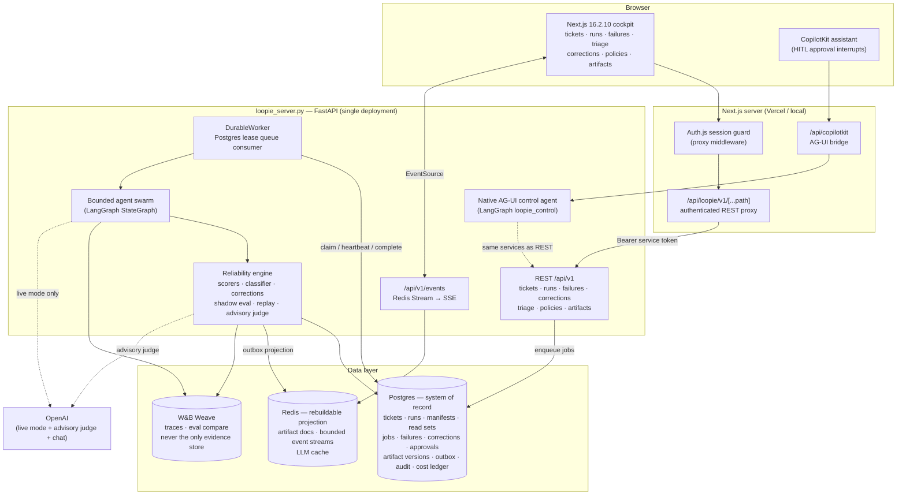
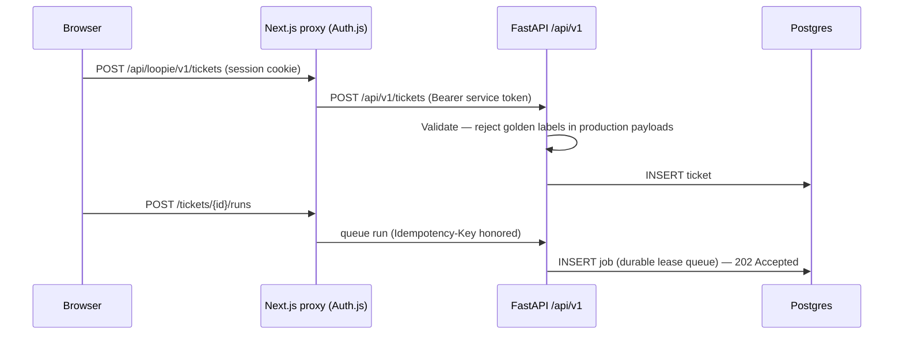
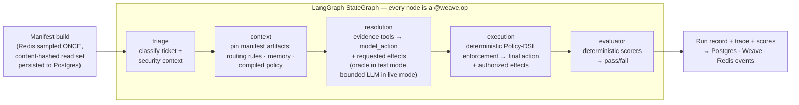

# Loopie

**A closed-loop reliability control plane for agent swarms.**

Loopie runs support tickets (refunds, billing, security) through a bounded LangGraph agent swarm, grades every run with deterministic scorers, and — when a run fails — traces *why*, proposes a **typed, human-reviewable correction**, shadow-tests it, and proves recovery by rerunning the same ticket against the patched artifact. Every claim of improvement is backed by a before/after eval delta, not a vibe.

```text
baseline fails → trace explains why → candidate artifact differs →
shadow evaluation passes → human approves → durable artifact commits →
same ticket reruns → deterministic score improves without regressions
```

That invariant is the product. Nothing ships around it.

---

## Table of contents

- [Why Loopie](#why-loopie)
- [System architecture](#system-architecture)
  - [Component overview](#component-overview)
  - [The two planes](#the-two-planes)
  - [Data stores and their contracts](#data-stores-and-their-contracts)
- [Data flow, end to end](#data-flow-end-to-end)
  - [1. Ticket ingestion and job queuing](#1-ticket-ingestion-and-job-queuing)
  - [2. Run execution — the bounded swarm](#2-run-execution--the-bounded-swarm)
  - [3. Scoring, failure capture, and triage](#3-scoring-failure-capture-and-triage)
  - [4. Correction lifecycle](#4-correction-lifecycle)
  - [5. Live updates to the UI](#5-live-updates-to-the-ui)
- [Reliability guarantees](#reliability-guarantees)
- [Observability with W&B Weave](#observability-with-wb-weave)
- [API surface](#api-surface)
- [Repository layout](#repository-layout)
- [Getting started](#getting-started)
- [Configuration reference](#configuration-reference)
- [Verification](#verification)
- [License](#license)

---

## Why Loopie

Agent swarms fail in production, and most teams discover it from angry users rather than from their own tooling. When they do find a failure, the "fix" is usually a prompt tweak with no evidence it worked and no proof it didn't break something else.

Loopie treats agent reliability the way SRE treats infrastructure:

| Problem | Loopie's answer |
|---|---|
| Failures are invisible | Every run is scored by deterministic policy + structural scorers; failures become first-class records |
| Root cause is guesswork | Full per-node traces (timings, tool calls, artifact read-sets) land in W&B Weave |
| Fixes are untyped prompt edits | Corrections are a **typed union** (routing rule, memory update, policy guard) with a mutable-key allowlist |
| Fixes ship unreviewed | Every correction passes shadow evaluation and **mandatory human approval** before commit |
| "It's fixed" is unverifiable | Approval automatically queues a patched rerun; the improvement claim requires a fail→pass delta with no regressions |

---

## System architecture

### Component overview



Key structural decisions:

- **One backend deployment.** `agent/loopie_server.py` is the single composition root: REST API, AG-UI control agent, durable worker, and SSE all live in one FastAPI process. There is no second `langgraph dev` service to drift out of sync.
- **The UI never talks to the backend directly.** Every browser request passes through the Auth.js-guarded Next.js proxy, which attaches the service bearer token. The backend rejects unauthenticated requests with constant-time token comparison.
- **The chat is additive, never authoritative.** CopilotKit tools call the same service layer as the REST endpoints and the cockpit buttons — one source of truth for every action.

### The two planes

Loopie is one product with two deliberately separated planes:

1. **Execution plane** — the support-ticket swarm. A fixed LangGraph DAG (`triage → context → resolution → execution → evaluator`) that resolves each ticket under strict budgets. It is a *bounded* agent: the control flow is deterministic; only the resolution episode involves model choice, and even that is replaced by a deterministic oracle in test mode.
2. **Reliability plane** — the control loop around the swarm. Scoring, failure classification, correction proposal, shadow evaluation, human approval, artifact versioning, patched reruns, and counterfactual replay.

The planes share data stores but not authority: the reliability plane can change what future runs read (artifacts), never what a run in flight already read.

### Data stores and their contracts

| Store | Role | Contract |
|---|---|---|
| **Postgres** (`loopie` schema) | System of record | Everything durable lives here: `tickets`, `runs`, `run_manifests`, `run_read_sets`, `jobs`, `failures`, `triage_items`, `corrections`, `approvals`, `approval_events`, `artifact_versions`, `artifact_outbox`, `audit_events`, `cost_ledger`, `eval_runs`, `eval_case_results`, `policy_rules`, `golden_annotations`, `projects` |
| **Redis** | Rebuildable projection | Artifact documents (`loopie:{project}:artifact:doc:*`), bounded event streams (`loopie:{project}:events:*` via `XADD`/`XREAD`), and an LLM response cache. If Redis is wiped, it is rebuilt from Postgres — never the other way around |
| **W&B Weave** | Observability | Every swarm node, scorer, and diagnosis op is a `@weave.op`; eval suites compare baseline vs patched artifact states. Weave is evidence *presentation*; authoritative evidence always also lands in Postgres |

Two invariants keep this honest:

- **Redis is updated only after a durable Postgres commit**, via the `artifact_outbox` (transactional-outbox pattern). No dual writes.
- **Graph nodes never read mutable Redis mid-run.** Redis is sampled exactly once at run start into an immutable manifest (below).

---

## Data flow, end to end

### 1. Ticket ingestion and job queuing



Tickets arrive one at a time or as bulk imports (JSONL/JSON documents). Ticket bodies are **untrusted input**: they are never allowed to carry golden labels into production paths, and they are prompt-injection-hardened when passed to any LLM.

Runs are asynchronous by design. Queuing a run inserts a row into the Postgres-backed `jobs` table and returns `202`. The **DurableWorker** claims jobs with a lease (`claim → heartbeat → complete`), so a crashed worker's jobs are re-leased rather than lost, and horizontal workers never double-execute.

### 2. Run execution — the bounded swarm



The critical step happens **before** the DAG: the run service builds an **immutable manifest**. Redis artifacts (routing rules, policy memory, compiled policies) are read exactly once, content-hashed (canonical-JSON SHA-256), and recorded as an authoritative **read set** in Postgres. Every node receives only these materialized values, which means:

- A concurrent artifact mutation cannot change an in-flight decision.
- Any run is exactly replayable: same manifest → same deterministic path.
- A correction's blast radius is computable — you know precisely which runs read which artifact version.

Budgets are enforced structurally (max tool calls, max transitions), not by hoping the model behaves. In **test mode** (`LOOPIE_LLM_MODE=test`) the resolution episode is a deterministic oracle — the entire proof path runs at $0. In **live mode**, real OpenAI calls are made, metered into the cost ledger, and **failures surface as failures** — the system never silently falls back to the oracle to fake a success.

### 3. Scoring, failure capture, and triage

Pass/fail is decided by **deterministic scorers only** — no LLM in the authoritative path:

| Scorer | Checks |
|---|---|
| `action_match` | Final action matches expected/policy-derived action |
| `required_policy_checked` | Mandatory policy rules were consulted |
| `required_policy_rules_present` | Every policy rule required by the golden annotation exists in the pinned run manifest |
| `unauthorized_tool_call` | No tool outside the authorized surface was invoked |
| `loop_count_under_limit` | Transition budget respected |
| `tool_calls_under_budget` | Tool-call budget respected |
| `memory_version_correct` | Run read the expected artifact versions |
| `action_in_taxonomy` | Action belongs to the known action taxonomy |
| `production_decision_completed` | Live decisions completed honestly (no oracle fallback) |

An **advisory LLM judge** may add a semantic opinion, but it *never* flips authoritative pass/fail. When the judge and deterministic layer disagree, a **triage item** is created for a human to resolve — disagreements are data, not overrides. Judge calibration is tracked against resolved triage decisions.

A failed run produces a `failures` row with the classified failure category (`stale_memory`, `missing_guard`, `loop_detected`, …) and links to the run, manifest, and trace evidence.

### 4. Correction lifecycle

This is the heart of Loopie — every arrow below is auditable:

```mermaid
sequenceDiagram
    participant H as Human (UI / HITL chat / REST)
    participant CS as CorrectionService
    participant SH as Shadow evaluator
    participant AS as ApprovalService (single path)
    participant PG as Postgres
    participant OB as Outbox projector
    participant R as Redis
    participant W as Worker (patched rerun)

    Note over CS: Failure classified → typed proposal
    CS->>CS: Map failure category → typed correction<br/>(routing rule / memory update / policy guard)
    CS->>CS: Generate with strict OpenAI wire schema<br/>(no oneOf / discriminated union in response_format)
    CS->>CS: Convert + validate typed union · mutable-key allowlist ·<br/>Policy-DSL compilation where applicable
    CS->>SH: Shadow evaluation — rerun failing case against<br/>candidate manifest (no state mutation)
    alt shadow passes
        SH-->>CS: proposed — eligible for human review
        CS->>PG: UPSERT correction with candidate diff + proof
    else shadow fails
        SH-->>CS: shadow_failed — keep failure open and retryable
        CS->>PG: UPSERT failed shadow evidence; do not expose approval action
    end

    H->>AS: approve(correction_id, actor, channel)
    AS->>PG: TRANSACTION: commit correction ·<br/>CAS artifact version bump (v1→v2) ·<br/>approval + audit events · outbox row
    AS->>OB: project_pending_outbox()
    OB->>R: write committed artifact doc<br/>(only AFTER durable commit)
    AS->>PG: queue patched rerun of the SAME ticket
    W->>W: rerun with new manifest (reads v2)
    W->>PG: patched run: fail → pass delta recorded
    Note over W: Counterfactual replay — neighbor tickets<br/>rerun to prove no regression
```

Guard rails that cannot be bypassed:

- **Typed corrections only.** A correction is a structured object from a closed union — never a free-form patch. Model-generated proposals must survive schema validation, the mutable-key allowlist, and (for policy changes) Policy-DSL compilation.
- **Strict OpenAI response schema.** The model emits a flat `GeneratedCorrectionWire` object that is valid under OpenAI strict structured outputs. Loopie then converts that wire object into the internal typed correction union and applies kind-specific validation.
- **Shadow evaluation before review.** The candidate artifact is spliced into a copy of the failing run's manifest and re-evaluated. If the shadow run doesn't pass, the correction never reaches a human.
- **Failed shadows stay retryable.** A failed shadow is stored as `shadow_failed`, keeps the originating failure open, and never appears approval-ready in the UI.
- **One approval path.** UI button, CopilotKit HITL interrupt, and REST all converge on the same `ApprovalService`. Approval, compare-and-swap artifact commit, audit event, and outbox insertion happen in one place.
- **CAS versioning.** Artifact commits are compare-and-swap against the expected prior version, so two racing approvals cannot silently clobber each other. Version history (`artifact_versions`) powers the Time Machine view.
- **Proof, not promises.** Approving automatically queues a patched rerun of the originating ticket. An improvement claim requires the linked rerun to show a deterministic fail→pass delta — and counterfactual replay confirms neighboring tickets stayed green.

### 5. Live updates to the UI

Every state change (run started, scored, failure created, correction proposed/approved, artifact committed) is appended to a **bounded Redis Stream**. The FastAPI `/api/v1/events` endpoint tails that stream and re-emits it as **Server-Sent Events**, with `Last-Event-ID` resume support. The Next.js cockpit subscribes via `EventSource` (through the authenticated proxy), so the tickets, runs, failures, triage, corrections, policies, and artifacts pages update in real time without polling.

Because the stream is a bounded projection — not the record — losing it costs nothing: the UI re-hydrates from the REST API, which reads Postgres.

---

## Reliability guarantees

A summary of the invariants the codebase enforces (see [`loopie-copilotkit/CLAUDE.md`](loopie-copilotkit/CLAUDE.md) for the development contract):

1. **Postgres is the system of record; Redis is a rebuildable projection.** Never the reverse.
2. **Immutable manifests + authoritative read sets.** No graph node reads mutable Redis mid-run.
3. **Deterministic authoritative scoring.** Golden annotations are test/eval-only; the LLM judge is advisory.
4. **Live LLM failures surface as failures.** No silent oracle fallback in production paths.
5. **Corrections pass typed validation → allowlist → shadow eval → human review.** In that order, no skips.
6. **Single approval service** owns approval, CAS commit, audit, and outbox insertion atomically.
7. **Improvement claims require linked rerun evidence** — fail→pass delta plus no-regression replay.
8. **Ticket bodies stay untrusted** in every prompt; secrets are never committed or printed.

---

## Observability with W&B Weave

Weave is wired in as the eval-compare layer, not bolted-on logging:

- **Traces** — every swarm node, scorer, and diagnosis op is a `@weave.op` with DSN/secret redaction; per-node latency and tool surfaces are inspectable per run.
- **Native Golden Demo evaluations** — `weave.EvaluationLogger` wraps the real live baseline, shadow baseline/candidate suite, and applied rerun already executed by the product. It publishes comparable `v1`, `v2_candidate`, and applied `v2` evaluations without duplicating OpenAI calls.
- **Proof columns** — before/after artifact content hashes and the correction id are attached as eval attributes, tying the dashboard back to the Postgres audit trail.
- **Concise run columns** — `loopie.run` exposes stable top-level outputs for `case_id`, `phase`, `evaluation_status`, `action`, `model_action`, `policy_enforced_by`, `mode`, `decided_by`, `fallback_used`, `wall_clock_ms`, and `run_id`. These are the recommended saved-view columns; no synthesized `summary.weave.latency_ms` field is required.
- **Deep links** — the cockpit surfaces live trace and baseline-vs-patched eval links.

Weave tracing runs independently of the LLM mode: with `LOOPIE_LLM_MODE=test` you get full trace observability at zero token cost. Native Golden Demo evaluations are published for the live judged path. Weave is intentionally **never the only evidence store** — the run record in Postgres remains authoritative.

---

## API surface

All routes live under `/api/v1` on the FastAPI service (proxied from the UI as `/api/loopie/v1/*`):

| Area | Endpoints | Notes |
|---|---|---|
| Health | `GET /healthz`, `GET /preflight` | Redis/Postgres/Weave/worker readiness report |
| Meta | `GET /meta` | Mode, project, taxonomy info |
| Tickets | `POST /tickets`, `POST /tickets/import`, `GET /tickets`, `GET /tickets/{id}` | Import accepts JSONL/JSON; golden labels rejected |
| Runs | `POST /tickets/{id}/runs` (202, idempotent), `GET /runs`, `GET /runs/{id}` | Async via durable job queue |
| Failures | `GET /failures`, `GET /failures/{id}` | Classified failure records |
| Corrections | `POST /failures/{id}/corrections`, `GET /corrections`, `POST /corrections/{id}/approve`, `POST /corrections/{id}/reject` | Approve/reject route through the single ApprovalService |
| Triage | `GET /triage`, `POST /triage/{id}/resolve`, `GET /judge/calibration` | Judge/deterministic disagreements |
| Policies | `GET /policies`, `POST /policies/compile` | Policy-DSL compilation |
| Artifacts | `GET /artifacts` | Versioned artifact state (Time Machine) |
| Events | `GET /events` | SSE stream with `Last-Event-ID` resume |
| Demo | `POST /demo/reset`, `POST /demo/start` | Reset only restores the broken baseline; start separately queues the live Golden Demo run |

Authentication: every non-health request requires `Authorization: Bearer <LOOPIE_API_TOKEN>`; the browser never holds this token — only the Auth.js-guarded Next.js proxy does.

---

## Repository layout

```text
Loopie/
├── README.md                        ← you are here
├── render.yaml                      ← Render deployment blueprint
├── loopie-copilotkit/               ← main implementation
│   ├── CLAUDE.md                    ← development contract (invariants)
│   ├── src/                         ← Next.js 15 app
│   │   ├── auth.ts / proxy.ts       ← Auth.js session + route guard
│   │   ├── app/
│   │   │   ├── api/loopie/v1/[...path]/   ← authenticated REST proxy
│   │   │   ├── api/copilotkit/            ← AG-UI bridge to control agent
│   │   │   └── tickets|runs|failures|triage|corrections|policies|artifacts/
│   │   └── components/loopie-product/     ← cockpit pages, SSE hooks, assistant
│   ├── agent/                       ← Python backend (uv-managed)
│   │   ├── loopie_server.py         ← FastAPI composition root (the ONLY deployment)
│   │   ├── migrations/              ← Alembic schema (loopie.* tables)
│   │   ├── src/loopie/
│   │   │   ├── swarm.py             ← bounded LangGraph DAG
│   │   │   ├── manifests.py         ← immutable manifests + read-set hashing
│   │   │   ├── worker.py / jobs.py  ← durable Postgres lease queue
│   │   │   ├── control_agent.py     ← AG-UI control agent (CopilotKit)
│   │   │   ├── api/v1.py            ← REST surface
│   │   │   ├── services/            ← runs · corrections · approvals (single path)
│   │   │   ├── reliability/         ← scorers · classifier · correction_gen ·
│   │   │   │                          shadow eval · replay · advisory judge · oracle
│   │   │   ├── policy/              ← Policy DSL + compiler + seeds
│   │   │   ├── stores/              ← Postgres ledger · Redis store · LLM cache
│   │   │   └── observability.py     ← Weave init + redaction
│   │   └── tests/                   ← unit, integration, live-marked suites
│   └── docker/ · docker-compose*.yml← local infra + recovery test harness
└── loopie/docs/                     ← product design docs and runbooks
```

---

## Getting started

### Prerequisites

- Node.js 18+
- Python 3.12+ with [uv](https://docs.astral.sh/uv/)
- Docker (for local Postgres + Redis)
- Optional: `WANDB_API_KEY` for Weave, `OPENAI_API_KEY` for live mode/chat

### Local development

```bash
git clone https://github.com/kathangabani-nyu/Loopie.git
cd Loopie/loopie-copilotkit

# 1. Configure — never commit the result
cp .env.example .env.local
#    set: owner password, Auth.js secret, LOOPIE_API_TOKEN,
#         POSTGRES_URL, REDIS_URL

# 2. Infrastructure
npm run dev:infra          # local Postgres + Redis

# 3. Migrations
cd agent && uv run alembic upgrade head && cd ..

# 4. Run everything (UI :3000, API :8001)
npm run dev                # or: npm run dev:stack (infra + apps)
```

Sign in at `http://localhost:3000`, create or import tickets, queue runs, and walk the failure → correction → approval → rerun loop from the cockpit or the CopilotKit assistant.

### Hosted deployment

| Service | Platform |
|---|---|
| Next.js UI + proxy | Vercel |
| FastAPI (`loopie_server.py`) | Render (see [`render.yaml`](render.yaml)) |
| Postgres | Neon |
| Redis | Redis Cloud |
| Weave | W&B Cloud |

Hosted mode (`LOOPIE_HOSTED=1`) hard-requires Postgres, Redis, and the service token — there is no silent in-memory fallback.

---

## Configuration reference

| Variable | Default | Purpose |
|---|---|---|
| `LOOPIE_LLM_MODE` | `test` | `test` = deterministic oracle (zero-cost proof path) · `live` = real OpenAI resolution |
| `LOOPIE_REQUIRE_LIVE_LLM_CONFIRMATION` | `true` | Extra confirmation gate before live-mode spend |
| `LOOPIE_HOSTED` | unset | `1` requires Postgres + Redis + auth; disables all fallbacks |
| `LOOPIE_API_TOKEN` | — | Service bearer token shared by proxy and API |
| `POSTGRES_URL` / `REDIS_URL` | — | Data layer connections |
| `LOOPIE_WEAVE_ENABLED` | `true` | Weave traces + eval suites |
| `WANDB_API_KEY` / `WANDB_ENTITY` / `WEAVE_PROJECT` | — | W&B Weave credentials and project |
| `OPENAI_API_KEY` | — | Live mode, advisory judge, and chat |
| `LOOPIE_MAX_CHAT_COST_USD` | budget-capped | Chat spend ceiling, metered in the cost ledger |

---

## Verification

```powershell
cd loopie-copilotkit/agent
uv run ruff check src tests migrations loopie_server.py loopie_dev.py loopie_graph.py loopie_control.py
uv run pytest -m "not integration and not live" -q
uv run alembic upgrade head --sql

cd ..
npm run build
npm audit --omit=dev --audit-level=high
```

Real recovery tests (crash the worker mid-run, prove lease takeover and replay) run in containers:

```bash
docker compose -f docker-compose.test.yml up --build --abort-on-container-exit --exit-code-from tests
```

Live smoke tests are opt-in and budget-capped; see `.github/workflows/nightly-reliability.yml`.

---

## License

MIT — see [LICENSE](loopie-copilotkit/LICENSE).
