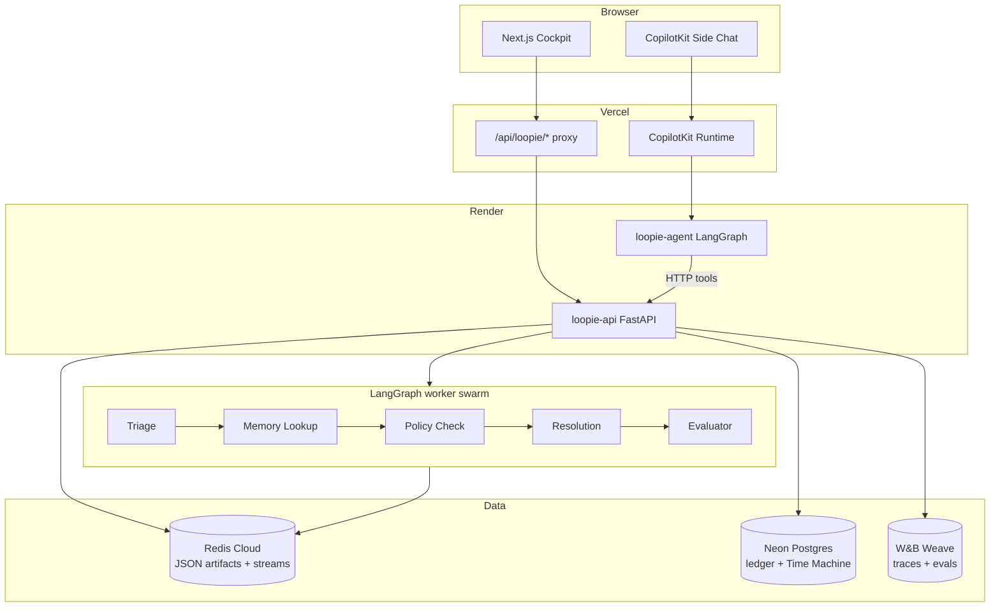

# Loopie

**Reliability CI for agent swarms** — catch failures, explain them with traces, stage a Redis correction, get human approval, rerun the same eval, and prove recovery with before/after scores.

Loopie is a closed-loop control plane for multi-agent support workflows. It combines a **LangGraph worker swarm**, **deterministic eval scorers**, **Redis live artifacts**, **Postgres audit history**, **Weights & Biases Weave** for traces and eval compare, **CopilotKit** for human-in-the-loop approval, and **OpenAI** for live supervisory chat — wired together so every step of the reliability story is inspectable, not hand-wavy.

---

## The demo in 60 seconds

A security-flagged refund ticket (`security_001`) should **escalate**, but the swarm is missing a routing guard in Redis. Loopie runs the story end-to-end:

1. **Baseline fails** — deterministic scorers catch `approve_refund` under an active security flag.
2. **Weave traces why** — per-node latency, tool surface, and scorer breakdown land in W&B.
3. **Fix proposed** — classifier maps the failure to a structured Redis routing rule (not a magic patch).
4. **Human approves** — CopilotKit HITL + cockpit buttons; artifact diff and blast radius are visible first.
5. **Same eval reruns** — patched artifact version (`v2`) recovers the hero case.
6. **Counterfactual replay** — neighbor tickets stay green; no regression.

The cockpit shows score deltas, event streams, artifact Time Machine versions, and Weave baseline vs patched eval links — a full proof path for judges and production SREs alike.

---

## Architecture



| Layer | Technology | Role |
|-------|------------|------|
| **UI** | Next.js 15, Framer Motion | Reliability cockpit — phase rail, trace viz, scorecard, artifact diff |
| **Agent UX** | CopilotKit | Live chat, frontend tools, human-in-the-loop approval interrupts |
| **Supervisor** | LangGraph (`loopie_control`) | Metered OpenAI chat that calls the same REST proof API as the buttons |
| **Worker swarm** | LangGraph StateGraph | Five-node pipeline: triage → memory → policy → resolution → evaluator |
| **Proof API** | FastAPI (`loopie-api`) | Baseline, propose, approve, patched rerun, counterfactual — authoritative state |
| **Live memory** | Redis Cloud (JSON) | Routing rules, policy versions, eval event streams (`XADD` / `XREAD`) |
| **Audit trail** | Neon Postgres | Artifact versioning, correction ledger, cost tracking, Time Machine |
| **Observability** | W&B Weave | `@weave.op` on every swarm node; `weave.Evaluation` suites for baseline vs patched |
| **LLM** | OpenAI (`gpt-5.5`) | Live chat + optional agentic diagnosis; proof path uses deterministic **test** mode |

---

## Multi-agent orchestration

Loopie uses **two LangGraph graphs** on purpose:

### Worker swarm (ticket execution)

Each eval case runs through a fixed DAG with real timings and narrations:

```
triage → memory_lookup → policy_check → resolution → evaluator
```

- **Triage** classifies the ticket and security context.
- **Memory lookup** reads policy version from Redis (staleness is part of the failure story).
- **Policy check** evaluates routing guards against live artifacts.
- **Resolution** authorizes tools and selects an action (oracle in test mode, live LLM when opted in).
- **Evaluator** grades deterministic scorers (`action_match`, `unauthorized_tool_call`, etc.).

Every node is wrapped with **Weave `@weave.op`** so latency, inputs (redacted), and outputs appear in the traces dashboard.

### Control agent (CopilotKit sidecar)

The **`loopie_control`** graph exposes the same pipeline as chat tools (`runBaseline`, `proposeCorrection`, `approveCorrection`, …) and streams partial state back to the UI. Chat spend is capped via **`LOOPIE_MAX_CHAT_COST_USD`** and recorded in the Postgres ledger — separate from the zero-cost deterministic proof path.

---

## Weave & W&B — used to full extent

Weave is not bolted on as logging. It is the **eval compare layer**:

| Capability | How Loopie uses it |
|------------|-------------------|
| **Live traces** | Every swarm node, scorer, and diagnosis op is a Weave op with DSN redaction |
| **Eval suites** | `weave.Evaluation` runs the ticket batch twice — artifact `v1` (baseline) vs `v2` (patched) |
| **Custom scorers** | Each deterministic scorer is a `weave.op` scorer in the evaluation |
| **Proof columns** | Before/after artifact hashes and correction id attached as eval attributes |
| **Dashboard links** | Cockpit surfaces live traces + baseline/patched eval deep links |

Set `LOOPIE_WEAVE_ENABLED=true`, `WANDB_API_KEY`, and `WANDB_ENTITY` on **loopie-api**. Weave runs independently of `LOOPIE_LLM_MODE=test` — you get full observability without burning tokens on the proof path.

---

## Redis & Postgres — live artifacts + Time Machine

**Redis** holds the runtime the swarm actually reads:

- `routing:rules` — JSON guard list (the demo fix adds `security_flag_blocks_refund`)
- Policy memory keys with version stamps
- `evals` stream — append-only audit events the cockpit renders live

**Postgres** is the durable ledger:

- Versioned artifact history (Time Machine UI: v1 → v2)
- Correction approvals with before/after hashes
- Cost ledger for chat vs pipeline

Hosted mode (`LOOPIE_HOSTED=1`) requires both — no silent in-memory fallback.

---

## CopilotKit & human-in-the-loop

Loopie uses CopilotKit for three things that matter in a reliability product:

1. **Frontend tools** — chat can drive the same actions as cockpit buttons (single source of truth via REST).
2. **`useHumanInTheLoop`** — approval interrupt shows artifact diff before apply.
3. **State streaming** — agent state merges with REST export; cockpit buttons stay authoritative for the proof path.

The side chat is additive. Judges can run the entire demo from buttons alone with **`LOOPIE_LLM_MODE=test · $0`**.

---

## Quick start (local)

### Prerequisites

- Node.js 18+
- Python 3.12+ and [uv](https://docs.astral.sh/uv/)
- Redis (local or Redis Cloud)
- Postgres (local or Neon) for hosted parity
- Optional: `WANDB_API_KEY` + `WANDB_ENTITY` for Weave

### 1. Clone and configure

```bash
git clone https://github.com/kathangabani-nyu/Loopie.git
cd Loopie/loopie-copilotkit
cp .env.example .env
```

Edit `.env` — at minimum:

```bash
REDIS_URL=redis://localhost:6379
POSTGRES_URL=postgresql://...
LOOPIE_LLM_MODE=test
LOOPIE_WEAVE_ENABLED=true
WANDB_API_KEY=...
WANDB_ENTITY=your-entity
WEAVE_PROJECT=loopie
OPENAI_API_KEY=...          # for live chat only
```

### 2. Run the stack

```bash
npm install
npm run dev
```

This starts:

- **Next.js UI** — http://localhost:3000
- **loopie-api** — http://localhost:8001 (proof backend)
- **loopie-agent** — http://localhost:8123 (CopilotKit LangGraph)

### 3. Run the demo

Click through the cockpit command bar (or press `1`–`5`):

`Run Baseline` → `Propose` → `Approve` → `Rerun + Compare` → `Counterfactual Replay`

Or toggle **Autopilot** with Space for a hands-free walkthrough.

---

## Hosted deployment

Production layout (see [`render.yaml`](render.yaml)):

| Service | Platform | Purpose |
|---------|----------|---------|
| Next.js UI | Vercel | Cockpit + `/api/loopie/*` proxy |
| `loopie-api` | Render | FastAPI proof backend |
| `loopie-agent` | Render | LangGraph + CopilotKit |
| Redis | Redis Cloud | Live artifacts + streams |
| Postgres | Neon | Ledger + Time Machine |
| Weave | W&B Cloud | Traces + eval compare |

Detailed env matrix: [`loopie/docs/hosted-demo-runbook.md`](loopie/docs/hosted-demo-runbook.md)

---

## Project structure

```
Loopie/
├── README.md                 ← you are here
├── render.yaml               ← Render Blueprint (api + agent)
├── loopie-copilotkit/        ← main implementation
│   ├── src/                  ← Next.js cockpit + CopilotKit
│   │   ├── app/api/loopie/   ← REST proxy to loopie-api
│   │   └── components/loopie-cockpit/
│   └── agent/                ← Python backend
│       ├── loopie_server.py  ← FastAPI entry
│       └── src/loopie/
│           ├── swarm.py      ← LangGraph worker DAG
│           ├── pipeline.py   ← baseline → fix → rerun orchestration
│           ├── control_agent.py
│           ├── reliability/  ← scorers, evals, corrections, replay
│           └── stores/       ← Redis + Postgres ledger
└── loopie/docs/              ← runbooks and build plans
```

---

## Environment reference

| Variable | Default (hosted) | Meaning |
|----------|------------------|---------|
| `LOOPIE_LLM_MODE` | `test` | Deterministic oracle decisions on proof path |
| `LOOPIE_WEAVE_ENABLED` | `true` | Weave traces + eval suites |
| `LOOPIE_HOSTED` | `1` | Require Redis + Postgres |
| `LOOPIE_MAX_EVAL_CASES_PER_DEV_RUN` | `6` | Tickets per Weave eval suite |
| `LOOPIE_OPENAI_MODEL` | `gpt-5.5` | Live chat model (agent service) |
| `LOOPIE_MAX_CHAT_COST_USD` | `40` | Chat spend cap |

Legacy `LOOPIE_LLM_MODE=mock` maps to `test`.

---

## Design principles

```text
trace → diagnose → persist correction → approve → rerun → compare
```

- **Structured corrections**, not free-form patches — every Redis mutation is typed, diffable, and replayable.
- **Same eval, two artifact states** — baseline and patched runs share scorers; improvement is measurable.
- **Human approval is mandatory** — artifact blast radius is shown before apply.
- **Counterfactual replay** — neighbor cases prove the fix did not regress the fleet.
- **Test mode for judging, Weave for proof, OpenAI for chat** — each tool used where it shines.

---

## License

MIT — see [LICENSE](LICENSE) if present in your fork.
